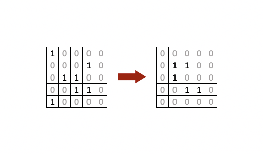

# Game of Life



This exercise tries to implement the well know [Game of Life](https://en.wikipedia.org/wiki/Conway%27s_Game_of_Life) in Ruby.

I know, this sounds a bit cumbersome since we only have the console to run or Ruby script and render the output in it and that sounds very limited, and yeah, for sure this is not the most elegant way to show this game in action but at least it does the job.

The idea is basically to be able to run a script _for ever_ (until we interrupt the script manually) and render the actual state of the matrix.

* You maybe asking what about performance? 🤔
* Will it overflow the computer memory? 🤔
* Will it kill my computer at some point? 🤔

Do not panic, this script uses **only two data structures** (2D arrays) and swap data from one to the other and in that sense
it won't increase space and eventually kill your RAM.

_Keep calm and give it a try!_ 😎

## Usage

> First make sure you have Ruby installed in your system. You can follow the [instructions here](https://www.ruby-lang.org/es/downloads/) depending on your OS.
> It is recommended to use `Ruby 2.7.4 and newer version`.

To use the application, first, in your terminal run the following command to clone this repo using the next command:

```sh
$ git clone https://github.com/alexventuraio/game-of-life.git
```

Then, access the folder with:

```sh
$ cd game-of-life/
```

Now, to start the app run the following command:

```sh
$ ruby game_of_life.rb
```

At this point you will be able to see the application in action. 🎉🎉🎉

## Trade-offs

- Since this is a console script, to show the evolution of the original data while getting transformed consist in only rendering the matrix in console and it is not the best user experience.
- Also there is no way for the user to input a custom starting matrix of data without getting into the code and modifying it.
- I wanted to start with an OOP approach in mind, to make it extensible and reusable. I was thinking to manage it with two main classes `Cell` and `Grid` just the same way that we trate a linked `List` as a group of `Nodes`.
	- That way it may be more isolated and well distributed since each cell has its own state that will change during its life time and only the needed methods to calculate its surrounding neighbors.
	- It looked easy to create arrays of `Cell` objects, at least from a concept-in-mind perspective.
-  Even it sounds well designed I found that:
	- It may not be the most performant approach when it comes to create very large (M x M) `Grid`s, like 1000 x 1000.
	- The memory space will increase drastically with tons of separate object instances.
	- It does not make sense at all to have `Cell` objects for empty cell.
	- Maybe the code will be a lot more to manipulate the business logic.
- That's why I decided not to go this way.

  ```ruby
  class Cell
    def initialize(x, y, state)
      @state = state || 0
      @x = x
      @y = y
    end

    private

    def count_neighbors
    end
  end
  ```

## Considerations

- I build it with only square matrix in mind, so, there should be some places where we need to adjust indexes and matrix boundaries.
- I only considere 2D arrays (matrix) but what about 3D or _Nth_ D matrix.
- I consider filling in the matrix cells on the fly with random (0, 1) values and also passing a custom matrix to work with.
- Something that I noticed is that the edges around the matrix rarely change.
- Maybe we should considere a more elegant way to stop the script once is run, maybe for a period of time.
- Since it is a bit difficult to see the evolution of the cells in the console, I tried to use some time-out for the user to see the evolution on the data between turns.
- I considered using only two data structures (matrix) for performance reasons since this script should be running _for ever_ in order to not to have memory issues.

## License

MIT

**Free Software, Hell Yeah!**

[//]: # (These are reference links used in the body of this note and get stripped out when the markdown processor does its job. There is no need to format nicely because it shouldn't be seen.)

   [game_of_life]: <https://github.com/alexventuraio/game-of-life>
   [git-repo-url]: <https://github.com/alexventuraio/game-of-life.git>
   [wiki_info]: <https://en.wikipedia.org/wiki/Conway%27s_Game_of_Life>
   [install_ruby]: <https://www.ruby-lang.org/es/downloads/>

